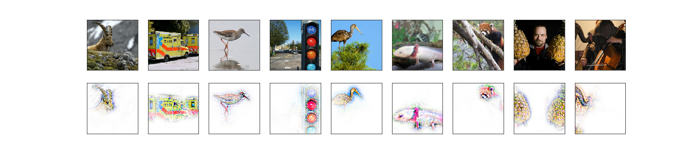
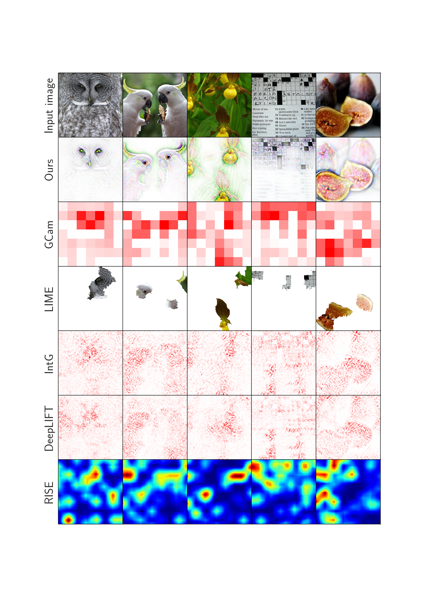
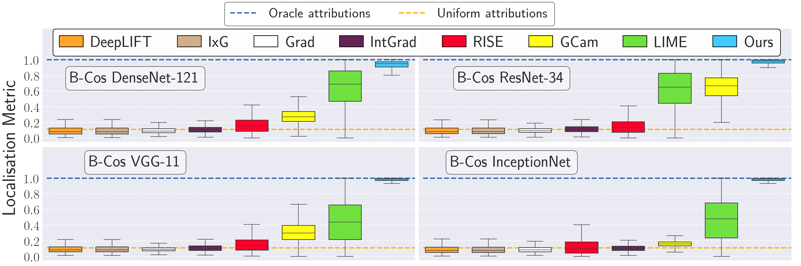

# B-cos Networks: Alignment is All We Need for Interpretability

M. Böhle, M. Fritz, B. Schiele. **B-cos Networks: Alignment is All we Need for Interpretability**. CVPR, 2022.
<div style="displaystyle=block;align=center;"><p align="center" >
  
  </p>
</div>

# Overview

* Qualitative Examples
  - Apart from the examples shown above, we additionally present some [comparisons](#comparison-to-post-hoc-methods) to post-hoc explanations.
  - In order to highlight the stability of the explanations, we additionally present contribution maps [evaluated on videos](#evaluated-on-videos).
  - For the latter, see [VideoEvaluation.ipynb](VideoEvaluation.ipynb),
    for the others check out the jupyter notebook [Qualitative Examples](Qualitative%20Examples.ipynb).


## Evaluated on videos
In order to highlight the stability of the contribution-based explanations of 
the B-cos-Nets, here we provide explanations on videos; for more information, see [VideoEvaluation.ipynb](VideoEvaluation.ipynb).
<div style="displaystyle=block;align=center"><p align="center">
  
  
  
</p></div>


## Comparison to post-hoc methods
<div style="displaystyle=block;align=center;"><p align="center" >
  
  </p>
</div>


## Quantitative Interpretability results
In order to reproduce these plots, check out the jupyter notebook
[Quantitative results](Quantitative%20results.ipynb). For more information, see the paper and check out the code at [interpretability/](interpretability/)

<div style="displaystyle=block;align=center;"><p align="center" >
  
  </p>
</div>


# Copyright and license
Copyright (c) 2022 Moritz Böhle, Max-Planck-Gesellschaft

This code is licensed under the BSD License 2.0, see [license](LICENSE).

Further, you use any of the code in this repository for your research, please cite as:
```
  @inproceedings{Boehle2022CVPR,
          author    = {Moritz Böhle and Mario Fritz and Bernt Schiele},
          title     = {B-cos Networks: Alignment is All we Need for Interpretability},
          journal   = {IEEE/CVF Conference on Computer Vision and Pattern Recognition ({CVPR})},
          year      = {2022}
      }
```

